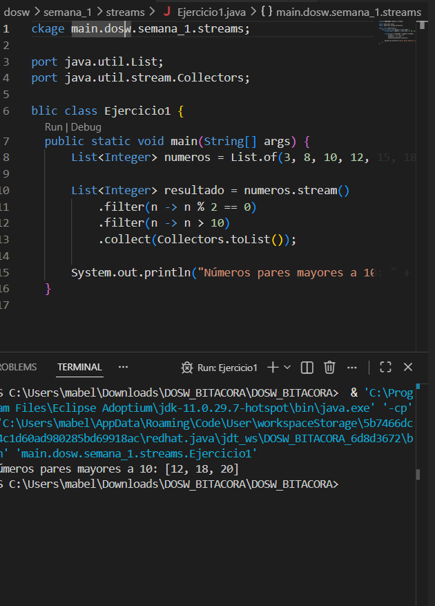

# SEMANA No 1 – DOSW Manejo de Streams

## Datos personales:
- Nombre: Mabel Bernal
- Código: 1000100629
- Curso: DOSW

---

## Ejercicio 01 – Números Pares mayores a diez

**Enunciado:** Dada una lista de números enteros, obtener solo los pares mayores a diez.

**Código implementado:**

```java
package dosw.semana_1.streams;

import java.util.List;
import java.util.stream.Collectors;

public class Ejercicio1 {
    public static void main(String[] args) {
        List<Integer> numeros = List.of(3, 8, 10, 12, 15, 18, 20);
        
        List<Integer> resultado = numeros.stream()
            .filter(n -> n % 2 == 0)
            .filter(n -> n > 10)
            .collect(Collectors.toList());
        
        System.out.println("Números pares mayores a 10: " + resultado);
    }
}
**Captura de ejecución:**

h

**Explicación:**

Primero convertimos la lista en un Stream con .stream().
Luego aplicamos .filter() dos veces: el primer filtro selecciona los números pares (n % 2 == 0) y el segundo filtro selecciona los números mayores a 10 (n > 10).
Por último, .collect(Collectors.toList()) convierte el resultado en una lista. 

## Ejercicio 02 – Cantidad de Palabras con más de 4 caracteres

**Enunciado:** Dada una lista de palabras, filtrar las que tengan más de 4 caracteres, convertirlas a mayúsculas, ordenarlas alfabéticamente y mostrar la cantidad total.

**Código implementado:**

```java
package dosw.semana_1.streams;

import java.util.List;

public class Ejercicio2 {
    public static void main(String[] args) {
        List<String> palabras = List.of("java", "stream", "api", "functional", "code", "git");
        
        long cantidad = palabras.stream()
            .filter(p -> p.length() > 4)
            .map(String::toUpperCase)
            .sorted()
            .count();
        
        System.out.println("Cantidad de palabras resultantes: " + cantidad);
    }
}

**Captura de ejecución:**

https://evidencias/ejercicio2.png

**Explicación:** 
Primero convertimos la lista en un Stream con .stream(). Luego usamos .filter() para quedarnos solo con las palabras que tienen más de 4 letras (descartamos "java", "api", "code", "git"). Después .map() las convierte a mayúsculas, .sorted() las ordena alfabéticamente y .count() cuenta cuántas quedaron. El resultado es 2 porque solo "stream" y "functional" cumplen la condición.