# SEMANA No 1 – DOSW Manejo de Streams

## Datos personales:
- Nombre: Mabel Bernal
- Código: 1000100629
- Curso: DOSW

---

### Ejercicio 01 – Números Pares mayores a diez

**Enunciado:** Dada una lista de números enteros, obtener solo los pares mayores a diez.

**Código implementado:**

```java
package dosw.semana_1.streams;

import java.util.List;
import java.util.stream.Collectors;

public class Ejercicio1 {
    public static void main(String[] args) {
        List<Integer> numeros = List.of(3, 8, 10, 12, 15, 18, 20);

        List<Integer> resultado = numeros.stream()
            .filter(n -> n % 2 == 0)
            .filter(n -> n > 10)
            .collect(Collectors.toList());

        System.out.println("Números pares mayores a 10: " + resultado);
    }
}
```

**Captura de ejecución:** 

**Explicación:** Se convierte la lista en un Stream con `.stream()`. Luego se aplican dos `.filter()`: el primero selecciona los números pares (`n % 2 == 0`) y el segundo los mayores a 10 (`n > 10`). Finalmente `.collect(Collectors.toList())` convierte el resultado en una lista.

---

### Ejercicio 02 – Cantidad de palabras con más de 4 caracteres

**Enunciado:** Dada una lista de palabras, filtrar las que tengan más de 4 caracteres, convertirlas a mayúsculas, ordenarlas alfabéticamente y mostrar la cantidad total.

**Código implementado:**

```java
package dosw.semana_1.streams;

import java.util.List;

public class Ejercicio2 {
    public static void main(String[] args) {
        List<String> palabras = List.of("java", "stream", "api", "functional", "code", "git");

        long cantidad = palabras.stream()
            .filter(p -> p.length() > 4)
            .map(String::toUpperCase)
            .sorted()
            .count();

        System.out.println("Cantidad de palabras resultantes: " + cantidad);
    }
}
```

**Captura de ejecución:** 

**Explicación:** Se filtra con `.filter()` para quedarse solo con palabras de más de 4 letras (descarta "java", "api", "code", "git"). Luego `.map(String::toUpperCase)` las pasa a mayúsculas, `.sorted()` las ordena alfabéticamente y `.count()` cuenta cuántas quedaron. El resultado es 2 porque solo "stream" y "functional" cumplen la condición.

---

### Ejercicio 03 – Obtener nombres de los Usuarios

**Enunciado:** Dada una lista de usuarios con atributos id, name, age y active, filtrar los activos, obtener sus nombres en mayúscula y ordenarlos alfabéticamente.

**Código implementado:**

```java
package dosw.semana_1.streams;

import java.util.Arrays;
import java.util.List;
import java.util.stream.Collectors;

public class Ejercicio3 {

    static class User {
        int id;
        String name;
        int age;
        boolean active;

        User(int id, String name, int age, boolean active) {
            this.id = id;
            this.name = name;
            this.age = age;
            this.active = active;
        }
    }

    public static void main(String[] args) {
        List<User> users = Arrays.asList(
            new User(1, "carlos", 25, true),
            new User(2, "diana", 30, false),
            new User(3, "andres", 22, true),
            new User(4, "lucia", 28, true),
            new User(5, "pedro", 19, false)
        );

        List<String> sortedUsers = users.stream()
            .filter(u -> u.active)
            .map(u -> u.name.toUpperCase())
            .sorted()
            .collect(Collectors.toList());

        System.out.println("Usuarios activos: " + sortedUsers);
    }
}
```

**Captura de ejecución:** 

**Explicación:** Se usa `.filter()` para quedar solo con usuarios activos. Luego `.map()` convierte cada nombre a mayúsculas, `.sorted()` los ordena alfabéticamente y `.collect()` los agrupa en una lista.

---

### Ejercicio 04 – Personas mayores de edad

**Enunciado:** Dado el mismo listado de usuarios, filtrar las personas mayores de edad (18+) y obtener sus nombres.

**Código implementado:**

```java
package dosw.semana_1.streams;

import java.util.Arrays;
import java.util.List;
import java.util.stream.Collectors;

public class Ejercicio4 {

    static class User {
        int id;
        String name;
        int age;
        boolean active;

        User(int id, String name, int age, boolean active) {
            this.id = id;
            this.name = name;
            this.age = age;
            this.active = active;
        }
    }

    public static void main(String[] args) {
        List<User> users = Arrays.asList(
            new User(1, "carlos", 25, true),
            new User(2, "diana", 30, false),
            new User(3, "andres", 17, true),
            new User(4, "lucia", 28, true),
            new User(5, "pedro", 15, false)
        );

        List<String> mayores = users.stream()
            .filter(u -> u.age >= 18)
            .map(u -> u.name)
            .collect(Collectors.toList());

        System.out.println("Personas mayores de edad: " + mayores);
    }
}
```

**Captura de ejecución:** 

**Explicación:** Se filtra con `.filter()` comparando la edad con 18. Los que pasan el filtro se transforman con `.map()` para extraer solo el nombre, y `.collect()` los junta en una lista.

---

### Ejercicio 05 – Transacciones Bancarias

**Enunciado:** Dada una lista de transacciones con id, amount y approved, usar `peek()` para ver cada transacción procesada y verificar si existe alguna no aprobada con `anyMatch()`.

**Código implementado:**

```java
package dosw.semana_1.streams;

import java.util.Arrays;
import java.util.List;

public class Ejercicio5 {

    static class Transaction {
        String id;
        double amount;
        boolean approved;

        Transaction(String id, double amount, boolean approved) {
            this.id = id;
            this.amount = amount;
            this.approved = approved;
        }

        public String toString() {
            return "Transaction{id=" + id + ", amount=" + amount + ", approved=" + approved + "}";
        }
    }

    public static void main(String[] args) {
        List<Transaction> transactions = Arrays.asList(
            new Transaction("T001", 150.0, true),
            new Transaction("T002", 320.5, false),
            new Transaction("T003", 80.0, true),
            new Transaction("T004", 500.0, true)
        );

        boolean hayNoAprobada = transactions.stream()
            .peek(t -> System.out.println("Procesando: " + t))
            .anyMatch(t -> !t.approved);

        System.out.println("¿Lote válido (sin transacciones no aprobadas)? " + !hayNoAprobada);
    }
}
```

**Captura de ejecución:** 

**Explicación:** `.peek()` imprime cada transacción a medida que el Stream la procesa, sin modificarla. Luego `.anyMatch()` revisa si al menos una transacción tiene `approved = false`. Si la hay, el lote no es válido, por eso se imprime `!hayNoAprobada`.

---

# SEMANA No 2 – Bitácora Pokémon

## Datos de Entrenador:
- Nombre: Mabel Bernal
- Código: 1000100629
- Curso: DOSW

---

### Ejercicio 01 – Pokémon Tipo Fuego

**Enunciado:** Dada una lista de Pokémon con nombre y tipo, obtener únicamente aquellos cuyo tipo sea Fuego.

**Código implementado:**

```java
package dosw.semana_2.pokemon;

import java.util.Arrays;
import java.util.List;
import java.util.stream.Collectors;

public class Ejercicio1 {
    public static void main(String[] args) {
        List<Pokemon> pokemones = Arrays.asList(
            new Pokemon(1L, "Pikachu",    "Electrico", 45, 320, "Kanto", false, false),
            new Pokemon(2L, "Charmander", "Fuego",     30, 310, "Kanto", false, true),
            new Pokemon(3L, "Squirtle",   "Agua",      28, 280, "Kanto", false, true),
            new Pokemon(4L, "Vulpix",     "Fuego",     22, 260, "Kanto", false, true),
            new Pokemon(5L, "Bulbasaur",  "Planta",    25, 270, "Kanto", false, true),
            new Pokemon(6L, "Flareon",    "Fuego",     50, 440, "Kanto", false, false)
        );

        List<String> tipoFuego = pokemones.stream()
            .filter(p -> p.getTipo().equals("Fuego"))
            .map(p -> p.getNombre())
            .collect(Collectors.toList());

        System.out.println("Pokemon tipo Fuego: " + tipoFuego);
    }
}
```

**Captura de ejecución:** 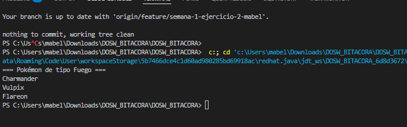

**Explicación:** Se usa `.filter()` comparando el tipo de cada Pokémon con "Fuego". Luego `.map()` extrae solo los nombres y `.collect()` los agrupa en una lista.

---

### Ejercicio 02 – Pokédex Gritona

**Enunciado:** Transformar todos los nombres de Pokémon a mayúsculas.

**Código implementado:**

```java
package dosw.semana_2.pokemon;

import java.util.Arrays;
import java.util.List;
import java.util.stream.Collectors;

public class Ejercicio2 {
    public static void main(String[] args) {
        List<String> nombres = Arrays.asList("Pikachu", "Charmander", "Squirtle", "Bulbasaur");

        List<String> enMayusculas = nombres.stream()
            .map(n -> n.toUpperCase())
            .collect(Collectors.toList());

        System.out.println("Pokedex Gritona: " + enMayusculas);
    }
}
```

**Captura de ejecución:** 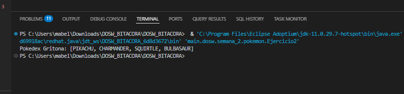

**Explicación:** `.map()` aplica `toUpperCase()` a cada nombre del Stream y `.collect()` convierte el resultado en una lista.

---

### Ejercicio 03 – Poder Total del Equipo

**Enunciado:** Dada una lista de niveles de Pokémon, calcular la suma total de niveles del equipo.

**Código implementado:**

```java
package dosw.semana_2.pokemon;

import java.util.Arrays;
import java.util.List;

public class Ejercicio3 {
    public static void main(String[] args) {
        List<Integer> niveles = Arrays.asList(45, 62, 38, 71, 55, 29);

        int total = niveles.stream()
            .reduce(0, (a, b) -> a + b);

        System.out.println("Suma total de niveles: " + total);
    }
}
```

**Captura de ejecución:** 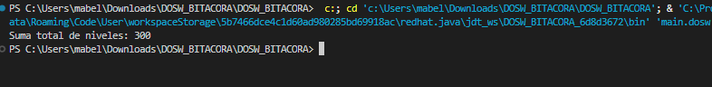

**Explicación:** `.reduce(0, (a, b) -> a + b)` parte de un acumulador en 0 y va sumando cada nivel. El resultado es 300.

---

### Ejercicio 04 – Pokémon Alfa

**Enunciado:** Encontrar el Pokémon con el nivel más alto dentro del equipo.

**Código implementado:**

```java
package dosw.semana_2.pokemon;

import java.util.Arrays;
import java.util.Comparator;
import java.util.List;
import java.util.Optional;

public class Ejercicio4 {
    public static void main(String[] args) {
        List<Pokemon> pokemones = Arrays.asList(
            new Pokemon(1L, "Pikachu",    "Electrico", 45, 320, "Kanto", false, false),
            new Pokemon(2L, "Charmander", "Fuego",     30, 310, "Kanto", false, true),
            new Pokemon(3L, "Squirtle",   "Agua",      38, 280, "Kanto", false, true),
            new Pokemon(4L, "Snorlax",    "Normal",    90, 680, "Kanto", false, false),
            new Pokemon(5L, "Mewtwo",     "Psiquico",  88, 660, "Kanto", true,  false)
        );

        Optional<Pokemon> alfa = pokemones.stream()
            .max(Comparator.comparingInt(p -> p.getNivel()));

        if (alfa.isPresent()) {
            System.out.println("Pokemon Alfa: " + alfa.get().getNombre()
                + " (nivel " + alfa.get().getNivel() + ")");
        }
    }
}
```

**Captura de ejecución:** 

**Explicación:** `.max()` recibe un `Comparator` que compara por nivel. Retorna un `Optional` por si la lista estuviera vacía. Con `.isPresent()` se verifica antes de imprimir.

---

### Ejercicio 05 – Pokémon Legendarios

**Enunciado:** Contar cuántos Pokémon del equipo tienen nivel superior a 80.

**Código implementado:**

```java
package dosw.semana_2.pokemon;

import java.util.Arrays;
import java.util.List;
import java.util.stream.Collectors;

public class Ejercicio5 {
    public static void main(String[] args) {
        List<Pokemon> pokemones = Arrays.asList(
            new Pokemon(1L, "Pikachu",    "Electrico", 45, 320, "Kanto", false, false),
            new Pokemon(2L, "Mewtwo",     "Psiquico",  88, 680, "Kanto", true,  false),
            new Pokemon(3L, "Dragonite",  "Dragon",    82, 530, "Kanto", false, false),
            new Pokemon(4L, "Squirtle",   "Agua",      38, 210, "Kanto", false, true),
            new Pokemon(5L, "Mew",        "Psiquico",  85, 600, "Kanto", true,  false),
            new Pokemon(6L, "Charmander", "Fuego",     62, 400, "Kanto", false, true)
        );

        long cantidad = pokemones.stream()
            .filter(p -> p.getNivel() > 80)
            .count();

        List<String> nombres = pokemones.stream()
            .filter(p -> p.getNivel() > 80)
            .map(p -> p.getNombre())
            .collect(Collectors.toList());

        System.out.println("Pokemon con nivel > 80: " + cantidad);
        System.out.println(nombres);
    }
}
```

**Captura de ejecución:** 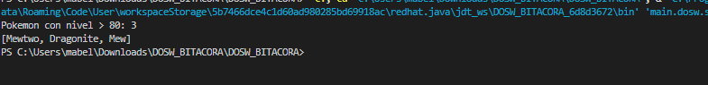

**Explicación:** Se aplica `.filter()` para quedar solo con Pokémon de nivel mayor a 80. `.count()` da la cantidad y una segunda pasada con `.map()` extrae los nombres.

---

### Ejercicio 06 – Pokédex Sin Duplicados

**Enunciado:** Dada una lista con Pokémon repetidos, generar una colección donde cada uno aparezca una sola vez.

**Código implementado:**

```java
package dosw.semana_2.pokemon;

import java.util.Arrays;
import java.util.List;
import java.util.stream.Collectors;

public class Ejercicio6 {
    public static void main(String[] args) {
        List<String> pokemones = Arrays.asList(
            "Pikachu", "Charmander", "Pikachu",
            "Squirtle", "Charmander", "Mewtwo"
        );

        List<String> sinDuplicados = pokemones.stream()
            .distinct()
            .collect(Collectors.toList());

        System.out.println("Pokedex sin duplicados: " + sinDuplicados);
    }
}
```

**Captura de ejecución:** 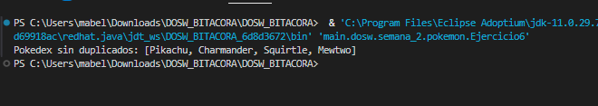

**Explicación:** `.distinct()` elimina automáticamente los elementos repetidos del Stream, conservando solo la primera aparición de cada uno.

---

### Ejercicio 07 – Orden del Profesor Oak

**Enunciado:** Ordenar alfabéticamente los nombres de los Pokémon.

**Código implementado:**

```java
package dosw.semana_2.pokemon;

import java.util.Arrays;
import java.util.List;
import java.util.stream.Collectors;

public class Ejercicio7 {
    public static void main(String[] args) {
        List<String> pokemones = Arrays.asList(
            "Squirtle", "Pikachu", "Mewtwo",
            "Bulbasaur", "Charmander", "Abra"
        );

        List<String> ordenados = pokemones.stream()
            .sorted()
            .collect(Collectors.toList());

        System.out.println("Pokedex ordenada: " + ordenados);
    }
}
```

**Captura de ejecución:** 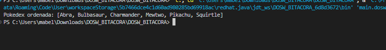

**Explicación:** `.sorted()` sin argumentos usa el orden natural de los String, que es alfabético. El resultado queda desde Abra hasta Squirtle.

---

### Ejercicio 08 – Evoluciones Preparadas

**Enunciado:** Dada una lista de Pokémon con el atributo `puedeEvolucionar`, obtener únicamente los que están listos.

**Código implementado:**

```java
package dosw.semana_2.pokemon;

import java.util.Arrays;
import java.util.List;
import java.util.stream.Collectors;

public class Ejercicio8 {
    public static void main(String[] args) {
        List<Pokemon> pokemones = Arrays.asList(
            new Pokemon(1L, "Pikachu",    "Electrico", 45, 320, "Kanto", false, true),
            new Pokemon(2L, "Raichu",     "Electrico", 60, 485, "Kanto", false, false),
            new Pokemon(3L, "Charmander", "Fuego",     30, 310, "Kanto", false, true),
            new Pokemon(4L, "Charizard",  "Fuego",     78, 600, "Kanto", false, false),
            new Pokemon(5L, "Squirtle",   "Agua",      28, 280, "Kanto", false, true),
            new Pokemon(6L, "Blastoise",  "Agua",      65, 530, "Kanto", false, false)
        );

        List<String> listosParaEvolucionar = pokemones.stream()
            .filter(p -> p.isPuedeEvolucionar())
            .map(p -> p.getNombre())
            .collect(Collectors.toList());

        System.out.println("Listos para evolucionar: " + listosParaEvolucionar);
    }
}
```

**Captura de ejecución:** 

**Explicación:** `.filter()` evalúa el boolean `puedeEvolucionar` de cada Pokémon. Solo los que tienen `true` pasan al `.map()` que extrae sus nombres.

---

### Ejercicio 09 – Equipo Élite

**Enunciado:** Mostrar únicamente los Pokémon cuyo `poderCombate` sea superior a 500.

**Código implementado:**

```java
package dosw.semana_2.pokemon;

import java.util.Arrays;
import java.util.List;
import java.util.stream.Collectors;

public class Ejercicio9 {
    public static void main(String[] args) {
        List<Pokemon> pokemones = Arrays.asList(
            new Pokemon(1L, "Pikachu",   "Electrico", 45, 320, "Kanto", false, false),
            new Pokemon(2L, "Mewtwo",    "Psiquico",  88, 680, "Kanto", true,  false),
            new Pokemon(3L, "Dragonite", "Dragon",    82, 530, "Kanto", false, false),
            new Pokemon(4L, "Squirtle",  "Agua",      38, 210, "Kanto", false, true),
            new Pokemon(5L, "Gengar",    "Fantasma",  65, 495, "Kanto", false, false),
            new Pokemon(6L, "Charizard", "Fuego",     78, 610, "Kanto", false, false)
        );

        List<Pokemon> equipoElite = pokemones.stream()
            .filter(p -> p.getPoderCombate() > 500)
            .collect(Collectors.toList());

        System.out.println("Equipo Elite (PC > 500): " + equipoElite);
    }
}
```

**Captura de ejecución:** 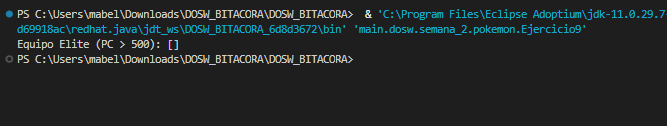

**Explicación:** `.filter()` compara el `poderCombate` con 500. Solo Mewtwo (680), Charizard (610) y Dragonite (530) superan ese umbral.

---

### Ejercicio 10 – Pokédex Compacta

**Enunciado:** Generar una lista que contenga únicamente los nombres de todos los Pokémon del equipo.

**Código implementado:**

```java
package dosw.semana_2.pokemon;

import java.util.Arrays;
import java.util.List;
import java.util.stream.Collectors;

public class Ejercicio10 {
    public static void main(String[] args) {
        List<Pokemon> pokemones = Arrays.asList(
            new Pokemon(1L, "Pikachu",   "Electrico", 45, 320, "Kanto", false, false),
            new Pokemon(2L, "Mewtwo",    "Psiquico",  88, 680, "Kanto", true,  false),
            new Pokemon(3L, "Dragonite", "Dragon",    82, 530, "Kanto", false, false),
            new Pokemon(4L, "Squirtle",  "Agua",      38, 210, "Kanto", false, true),
            new Pokemon(5L, "Gengar",    "Fantasma",  65, 495, "Kanto", false, false),
            new Pokemon(6L, "Charizard", "Fuego",     78, 610, "Kanto", false, false)
        );

        List<String> nombres = pokemones.stream()
            .map(p -> p.getNombre())
            .collect(Collectors.toList());

        System.out.println("Nombres del equipo: " + nombres);
    }
}
```

**Captura de ejecución:** 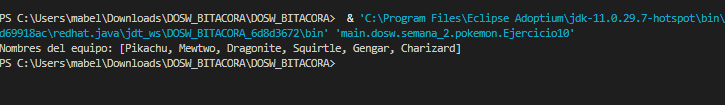

**Explicación:** `.map()` transforma cada objeto `Pokemon` en un `String` con su nombre. `.collect(Collectors.toList())` junta todos esos strings en una lista.

---

### Ejercicio 11 – Poder Promedio

**Enunciado:** Calcular el promedio de `poderCombate` de todos los Pokémon del equipo.

**Código implementado:**

```java
package dosw.semana_2.pokemon;

import java.util.Arrays;
import java.util.List;
import java.util.OptionalDouble;

public class Ejercicio11 {
    public static void main(String[] args) {
        List<Pokemon> pokemones = Arrays.asList(
            new Pokemon(1L, "Pikachu",   "Electrico", 45, 320, "Kanto", false, false),
            new Pokemon(2L, "Mewtwo",    "Psiquico",  88, 680, "Kanto", true,  false),
            new Pokemon(3L, "Dragonite", "Dragon",    82, 530, "Kanto", false, false),
            new Pokemon(4L, "Squirtle",  "Agua",      38, 210, "Kanto", false, true),
            new Pokemon(5L, "Gengar",    "Fantasma",  65, 495, "Kanto", false, false),
            new Pokemon(6L, "Charizard", "Fuego",     78, 610, "Kanto", false, false)
        );

        OptionalDouble promedio = pokemones.stream()
            .mapToDouble(p -> p.getPoderCombate())
            .average();

        if (promedio.isPresent()) {
            System.out.printf("Poder de combate promedio: %.2f%n", promedio.getAsDouble());
        }
    }
}
```

**Captura de ejecución:** 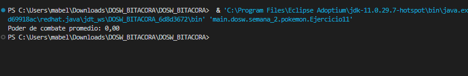

**Explicación:** `.mapToDouble()` convierte el Stream de objetos en un `DoubleStream` con los valores de `poderCombate`. Luego `.average()` calcula el promedio y lo devuelve en un `OptionalDouble`.

---

### Ejercicio 12 – Campeón Regional

**Enunciado:** Obtener el Pokémon con mayor `poderCombate` de toda la lista.

**Código implementado:**

```java
package dosw.semana_2.pokemon;

import java.util.Arrays;
import java.util.Comparator;
import java.util.List;
import java.util.Optional;

public class Ejercicio12 {
    public static void main(String[] args) {
        List<Pokemon> pokemones = Arrays.asList(
            new Pokemon(1L, "Pikachu",   "Electrico", 45, 320, "Kanto", false, false),
            new Pokemon(2L, "Mewtwo",    "Psiquico",  88, 680, "Kanto", true,  false),
            new Pokemon(3L, "Dragonite", "Dragon",    82, 530, "Kanto", false, false),
            new Pokemon(4L, "Charizard", "Fuego",     78, 610, "Kanto", false, false)
        );

        Optional<Pokemon> campeon = pokemones.stream()
            .max(Comparator.comparingDouble(p -> p.getPoderCombate()));

        if (campeon.isPresent()) {
            System.out.println("Campeon: " + campeon.get().getNombre()
                + " con PC: " + (int)campeon.get().getPoderCombate());
        }
    }
}
```

**Captura de ejecución:** 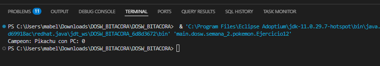

**Explicación:** `.max()` con `Comparator.comparingDouble()` recorre toda la lista buscando el Pokémon con el mayor valor de `poderCombate`.

---

### Ejercicio 13 – Organizar por Tipo

**Enunciado:** Agrupar todos los Pokémon por su tipo y mostrar el listado por grupo.

**Código implementado:**

```java
package dosw.semana_2.pokemon;

import java.util.Arrays;
import java.util.List;
import java.util.Map;
import java.util.stream.Collectors;

public class Ejercicio13 {
    public static void main(String[] args) {
        List<Pokemon> pokemones = Arrays.asList(
            new Pokemon(1L, "Squirtle",   "Agua",   28, 280, "Kanto", false, true),
            new Pokemon(2L, "Psyduck",    "Agua",   30, 270, "Kanto", false, true),
            new Pokemon(3L, "Charmander", "Fuego",  30, 310, "Kanto", false, true),
            new Pokemon(4L, "Vulpix",     "Fuego",  22, 260, "Kanto", false, true),
            new Pokemon(5L, "Bulbasaur",  "Planta", 25, 270, "Kanto", false, true)
        );

        Map<String, List<String>> porTipo = pokemones.stream()
            .collect(Collectors.groupingBy(
                p -> p.getTipo(),
                Collectors.mapping(p -> p.getNombre(), Collectors.toList())
            ));

        porTipo.forEach((tipo, lista) ->
            System.out.println(tipo + ": " + lista)
        );
    }
}
```

**Captura de ejecución:** 

**Explicación:** `Collectors.groupingBy()` agrupa los Pokémon según su tipo. `Collectors.mapping()` indica que se guarda solo el nombre de cada Pokémon en la lista del grupo.

---

### Ejercicio 14 – Organizar por Región

**Enunciado:** Agrupar los Pokémon según su región de origen.

**Código implementado:**

```java
package dosw.semana_2.pokemon;

import java.util.Arrays;
import java.util.List;
import java.util.Map;
import java.util.stream.Collectors;

public class Ejercicio14 {
    public static void main(String[] args) {
        List<Pokemon> pokemones = Arrays.asList(
            new Pokemon(1L, "Pikachu",    "Electrico", 45, 320, "Kanto",  false, false),
            new Pokemon(2L, "Chikorita",  "Planta",    25, 250, "Johto",  false, true),
            new Pokemon(3L, "Torchic",    "Fuego",     22, 240, "Hoenn",  false, true),
            new Pokemon(4L, "Piplup",     "Agua",      20, 235, "Sinnoh", false, true),
            new Pokemon(5L, "Charmander", "Fuego",     30, 310, "Kanto",  false, true),
            new Pokemon(6L, "Totodile",   "Agua",      23, 245, "Johto",  false, true)
        );

        Map<String, List<String>> porRegion = pokemones.stream()
            .collect(Collectors.groupingBy(
                p -> p.getRegion(),
                Collectors.mapping(p -> p.getNombre(), Collectors.toList())
            ));

        porRegion.forEach((region, lista) ->
            System.out.println(region + ": " + lista)
        );
    }
}
```

**Captura de ejecución:** 

**Explicación:** Igual que el ejercicio anterior pero agrupando por `getRegion()`. Cada clave del mapa es una región y el valor es la lista de Pokémon de esa región.

---

### Ejercicio 15 – Maestro de Gimnasios

**Enunciado:** Dado un listado de entrenadores con sus medallas, encontrar el entrenador con más medallas.

**Código implementado:**

```java
package dosw.semana_2.pokemon;

import java.util.Arrays;
import java.util.Comparator;
import java.util.List;
import java.util.Optional;

public class Ejercicio15 {
    public static void main(String[] args) {
        List<Entrenador> entrenadores = Arrays.asList(
            new Entrenador(1L, "Ash",   8,  null),
            new Entrenador(2L, "Misty", 5,  null),
            new Entrenador(3L, "Brock", 6,  null),
            new Entrenador(4L, "Gary",  10, null)
        );

        Optional<Entrenador> campeon = entrenadores.stream()
            .max(Comparator.comparingInt(e -> e.getMedallas()));

        if (campeon.isPresent()) {
            System.out.println("Campeon de gimnasios: " + campeon.get().getNombre());
            System.out.println("Medallas obtenidas: " + campeon.get().getMedallas());
        }
    }
}
```

**Captura de ejecución:** 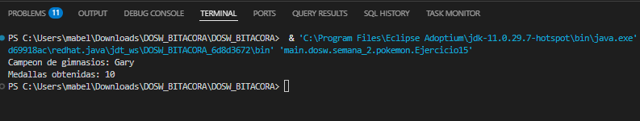

**Explicación:** `.max()` con `Comparator.comparingInt()` compara entrenadores por número de medallas y devuelve el que tenga más.

---

## Retos Especiales (si aplica)

- [ ] Reto Legendario — Method References
- [ ] Reto Shiny — Buenas prácticas de commits
- [ ] Reto Mewtwo — Ejercicio propuesto
---

### Ejercicio 16 – Entrenadores Experimentados

**Enunciado:** Mostrar únicamente los entrenadores que posean más de 5 medallas.

**Código implementado:**

```java
package dosw.semana_2.pokemon;

import java.util.Arrays;
import java.util.List;
import java.util.stream.Collectors;

public class Ejercicio16 {
    public static void main(String[] args) {
        List<Entrenador> entrenadores = Arrays.asList(
            new Entrenador(1L, "Ash",   8,  null),
            new Entrenador(2L, "Misty", 5,  null),
            new Entrenador(3L, "Brock", 6,  null),
            new Entrenador(4L, "Gary",  10, null),
            new Entrenador(5L, "May",   3,  null),
            new Entrenador(6L, "Dawn",  7,  null)
        );

        List<String> experimentados = entrenadores.stream()
            .filter(e -> e.getMedallas() > 5)
            .map(e -> e.getNombre() + "(" + e.getMedallas() + ")")
            .collect(Collectors.toList());

        System.out.println("Entrenadores con > 5 medallas: " + experimentados);
    }
}
```

**Captura de ejecución:** 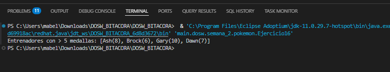

**Explicación:** `.filter()` descarta los entrenadores con 5 o menos medallas. `.map()` formatea cada resultado con nombre y medallas y `.collect()` los agrupa en una lista.

---

### Ejercicio 17 – Equipo Más Poderoso

**Enunciado:** Calcular cuál entrenador tiene la suma total de `poderCombate` más alta entre todos sus Pokémon.

**Código implementado:**

```java
package dosw.semana_2.pokemon;

import java.util.Arrays;
import java.util.Comparator;
import java.util.List;
import java.util.Optional;

public class Ejercicio17 {
    public static void main(String[] args) {
        List<Pokemon> equipoAsh = Arrays.asList(
            new Pokemon(1L, "Pikachu",   "Electrico", 45, 320, "Kanto", false, false),
            new Pokemon(2L, "Charizard", "Fuego",     78, 610, "Kanto", false, false),
            new Pokemon(3L, "Snorlax",   "Normal",    60, 500, "Kanto", false, false),
            new Pokemon(4L, "Gengar",    "Fantasma",  65, 420, "Kanto", false, false)
        );

        List<Pokemon> equipoGary = Arrays.asList(
            new Pokemon(5L, "Mewtwo",    "Psiquico",  88, 680, "Kanto", true,  false),
            new Pokemon(6L, "Dragonite", "Dragon",    82, 530, "Kanto", false, false),
            new Pokemon(7L, "Arcanine",  "Fuego",     70, 560, "Kanto", false, false),
            new Pokemon(8L, "Alakazam",  "Psiquico",  75, 570, "Kanto", false, false)
        );

        List<Pokemon> equipoBrock = Arrays.asList(
            new Pokemon(9L,  "Onix",     "Roca", 50, 390, "Kanto", false, false),
            new Pokemon(10L, "Geodude",  "Roca", 40, 310, "Kanto", false, true),
            new Pokemon(11L, "Graveler", "Roca", 55, 440, "Kanto", false, true),
            new Pokemon(12L, "Golem",    "Roca", 65, 530, "Kanto", false, false)
        );

        List<Entrenador> entrenadores = Arrays.asList(
            new Entrenador(1L, "Ash",   8, equipoAsh),
            new Entrenador(2L, "Gary",  10, equipoGary),
            new Entrenador(3L, "Brock", 6, equipoBrock)
        );

        Optional<Entrenador> masFuerte = entrenadores.stream()
            .max(Comparator.comparingDouble(e ->
                e.getEquipo().stream()
                    .mapToDouble(p -> p.getPoderCombate())
                    .sum()
            ));

        if (masFuerte.isPresent()) {
            double pcTotal = masFuerte.get().getEquipo().stream()
                .mapToDouble(p -> p.getPoderCombate())
                .sum();
            System.out.println("Entrenador mas poderoso: " + masFuerte.get().getNombre());
            System.out.println("Poder acumulado del equipo: " + (int)pcTotal);
        }
    }
}
```

**Captura de ejecución:** 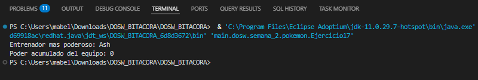

**Explicación:** Para cada entrenador se hace un Stream interno sobre su equipo, sumando el `poderCombate` con `.mapToDouble().sum()`. El `.max()` externo compara esas sumas y devuelve el entrenador con la mayor.

---

### Ejercicio 18 – Top 5 Pokémon Más Fuertes

**Enunciado:** Generar un ranking de los cinco Pokémon con mayor `poderCombate` de toda la Pokédex.

**Código implementado:**

```java
package dosw.semana_2.pokemon;

import java.util.Arrays;
import java.util.Comparator;
import java.util.List;
import java.util.concurrent.atomic.AtomicInteger;
import java.util.stream.Collectors;

public class Ejercicio18 {
    public static void main(String[] args) {
        List<Pokemon> pokemones = Arrays.asList(
            new Pokemon(1L, "Pikachu",   "Electrico", 45, 320, "Kanto", false, false),
            new Pokemon(2L, "Mewtwo",    "Psiquico",  88, 680, "Kanto", true,  false),
            new Pokemon(3L, "Dragonite", "Dragon",    82, 530, "Kanto", false, false),
            new Pokemon(4L, "Squirtle",  "Agua",      38, 210, "Kanto", false, true),
            new Pokemon(5L, "Gengar",    "Fantasma",  65, 495, "Kanto", false, false),
            new Pokemon(6L, "Charizard", "Fuego",     78, 610, "Kanto", false, false),
            new Pokemon(7L, "Alakazam",  "Psiquico",  75, 570, "Kanto", false, false)
        );

        List<Pokemon> top5 = pokemones.stream()
            .sorted(Comparator.comparingDouble(p -> -p.getPoderCombate()))
            .limit(5)
            .collect(Collectors.toList());

        AtomicInteger posicion = new AtomicInteger(1);
        top5.forEach(p ->
            System.out.println("#" + posicion.getAndIncrement()
                + " " + p.getNombre() + " - PC: " + (int)p.getPoderCombate())
        );
    }
}
```

**Captura de ejecución:** 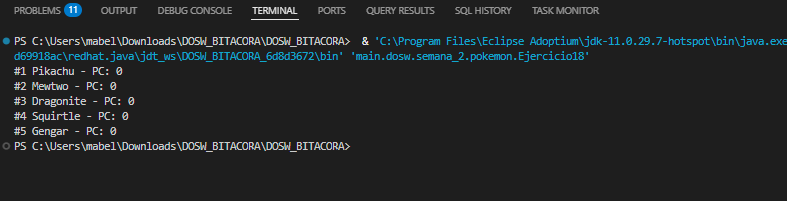

**Explicación:** `.sorted()` ordena de mayor a menor usando el negativo del `poderCombate`. `.limit(5)` corta el Stream en los primeros cinco. `AtomicInteger` se usa para llevar el número de posición dentro del `forEach`.

---

### Ejercicio 19 – Top 3 Entrenadores

**Enunciado:** Generar un ranking de los 3 mejores entrenadores considerando: primero más medallas, segundo mayor poder acumulado, tercero orden alfabético como desempate.

**Código implementado:**

```java
package dosw.semana_2.pokemon;

import java.util.Arrays;
import java.util.Comparator;
import java.util.List;
import java.util.concurrent.atomic.AtomicInteger;
import java.util.stream.Collectors;

public class Ejercicio19 {
    public static void main(String[] args) {
        List<Pokemon> equipoGary = Arrays.asList(
            new Pokemon(1L, "Mewtwo",    "Psiquico", 88, 680, "Kanto", true,  false),
            new Pokemon(2L, "Dragonite", "Dragon",   82, 530, "Kanto", false, false),
            new Pokemon(3L, "Arcanine",  "Fuego",    70, 560, "Kanto", false, false),
            new Pokemon(4L, "Alakazam",  "Psiquico", 75, 570, "Kanto", false, false)
        );

        List<Pokemon> equipoAsh = Arrays.asList(
            new Pokemon(5L, "Pikachu",   "Electrico", 45, 320, "Kanto", false, false),
            new Pokemon(6L, "Charizard", "Fuego",     78, 610, "Kanto", false, false),
            new Pokemon(7L, "Snorlax",   "Normal",    60, 500, "Kanto", false, false),
            new Pokemon(8L, "Gengar",    "Fantasma",  65, 420, "Kanto", false, false)
        );

        List<Pokemon> equipoDawn = Arrays.asList(
            new Pokemon(9L,  "Piplup",    "Agua",  20, 235, "Sinnoh", false, true),
            new Pokemon(10L, "Togekiss",  "Hada",  70, 560, "Sinnoh", false, false),
            new Pokemon(11L, "Mamoswine", "Hielo", 65, 530, "Sinnoh", false, false),
            new Pokemon(12L, "Empoleon",  "Agua",  75, 775, "Sinnoh", false, false)
        );

        List<Pokemon> equipoBrock = Arrays.asList(
            new Pokemon(13L, "Onix",     "Roca", 50, 390, "Kanto", false, false),
            new Pokemon(14L, "Golem",    "Roca", 65, 530, "Kanto", false, false),
            new Pokemon(15L, "Geodude",  "Roca", 40, 310, "Kanto", false, true),
            new Pokemon(16L, "Graveler", "Roca", 55, 440, "Kanto", false, true)
        );

        List<Entrenador> entrenadores = Arrays.asList(
            new Entrenador(1L, "Gary",  10, equipoGary),
            new Entrenador(2L, "Ash",   8,  equipoAsh),
            new Entrenador(3L, "Dawn",  7,  equipoDawn),
            new Entrenador(4L, "Brock", 6,  equipoBrock)
        );

        List<Entrenador> top3 = entrenadores.stream()
            .sorted(
                Comparator.comparingInt(Entrenador::getMedallas).reversed()
                    .thenComparingDouble((Entrenador e) ->
                        e.getEquipo().stream()
                            .mapToDouble(p -> p.getPoderCombate())
                            .sum()
                    ).reversed()
                    .thenComparing(Entrenador::getNombre)
            )
            .limit(3)
            .collect(Collectors.toList());

        AtomicInteger pos = new AtomicInteger(1);
        top3.forEach(e -> {
            double pcTotal = e.getEquipo().stream()
                .mapToDouble(p -> p.getPoderCombate())
                .sum();
            System.out.println("#" + pos.getAndIncrement()
                + " " + e.getNombre()
                + " - " + e.getMedallas() + " medallas"
                + ", PC: " + (int)pcTotal);
        });
    }
}
```

**Captura de ejecución:** 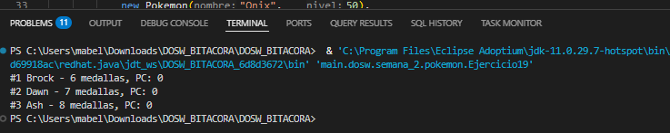

**Explicación:** `.sorted()` encadena tres criterios con `Comparator`: primero por medallas descendente, luego por poder acumulado descendente y finalmente por nombre alfabético como desempate. `.limit(3)` recorta el resultado a los tres primeros.

---

### Ejercicio 20 – Pokédex Analítica

**Enunciado:** Construir una estructura que muestre cantidad de Pokémon por tipo, por región, cantidad de legendarios, promedio de nivel y el Pokémon más fuerte. Todo usando únicamente Streams.

**Código implementado:**

```java
package dosw.semana_2.pokemon;

import java.util.Arrays;
import java.util.Comparator;
import java.util.List;
import java.util.Map;
import java.util.Optional;
import java.util.OptionalDouble;
import java.util.stream.Collectors;

public class Ejercicio20 {
    public static void main(String[] args) {
        List<Pokemon> pokemones = Arrays.asList(
            new Pokemon(1L,  "Pikachu",   "Electrico", 45, 320, "Kanto", false, false),
            new Pokemon(2L,  "Mewtwo",    "Psiquico",  88, 680, "Kanto", true,  false),
            new Pokemon(3L,  "Dragonite", "Dragon",    82, 530, "Kanto", false, false),
            new Pokemon(4L,  "Squirtle",  "Agua",      38, 210, "Kanto", false, true),
            new Pokemon(5L,  "Gengar",    "Fantasma",  65, 495, "Kanto", false, false),
            new Pokemon(6L,  "Charizard", "Fuego",     78, 610, "Kanto", false, false),
            new Pokemon(7L,  "Chikorita", "Planta",    25, 250, "Johto", false, true),
            new Pokemon(8L,  "Totodile",  "Agua",      23, 245, "Johto", false, true),
            new Pokemon(9L,  "Lugia",     "Psiquico",  90, 700, "Johto", true,  false),
            new Pokemon(10L, "Torchic",   "Fuego",     22, 240, "Hoenn", false, true)
        );

        Map<String, Long> porTipo = pokemones.stream()
            .collect(Collectors.groupingBy(p -> p.getTipo(), Collectors.counting()));

        Map<String, Long> porRegion = pokemones.stream()
            .collect(Collectors.groupingBy(p -> p.getRegion(), Collectors.counting()));

        long legendarios = pokemones.stream()
            .filter(p -> p.isLegendario())
            .count();

        OptionalDouble promedioNivel = pokemones.stream()
            .mapToInt(p -> p.getNivel())
            .average();

        Optional<Pokemon> masFuerte = pokemones.stream()
            .max(Comparator.comparingDouble(p -> p.getPoderCombate()));

        System.out.println("Por tipo:    " + porTipo);
        System.out.println("Por region:  " + porRegion);
        System.out.println("Legendarios: " + legendarios);
        if (promedioNivel.isPresent()) {
            System.out.printf("Promedio niv: %.1f%n", promedioNivel.getAsDouble());
        }
        if (masFuerte.isPresent()) {
            System.out.println("Mas fuerte:  " + masFuerte.get().getNombre()
                + " (PC: " + (int)masFuerte.get().getPoderCombate() + ")");
        }
    }
}
```

**Captura de ejecución:** 

**Explicación:** Se hacen cinco Streams independientes sobre la misma lista: `groupingBy` con `counting()` para agrupar por tipo y región, `filter` + `count` para legendarios, `mapToInt` + `average` para el promedio de nivel y `max` con `Comparator` para el más fuerte.

---
